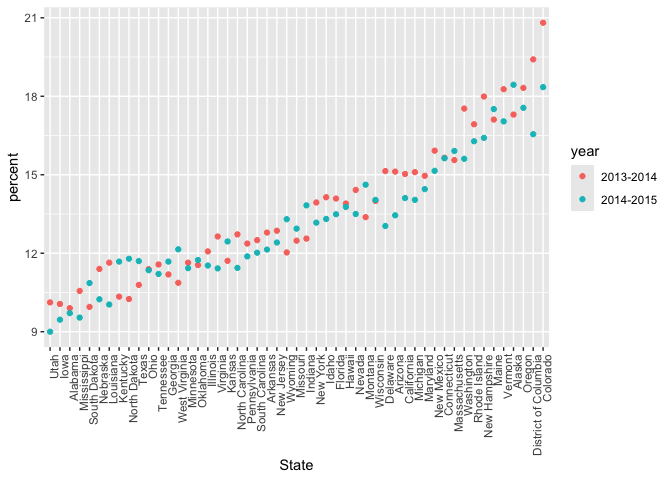

strings_and_factors
================
Rosie Kwon
2025-10-14

Load key packages.

``` r
library(rvest)
library(tidyverse)
```

    ## ── Attaching core tidyverse packages ──────────────────────── tidyverse 2.0.0 ──
    ## ✔ dplyr     1.1.4     ✔ readr     2.1.5
    ## ✔ forcats   1.0.0     ✔ stringr   1.5.1
    ## ✔ ggplot2   3.5.2     ✔ tibble    3.3.0
    ## ✔ lubridate 1.9.4     ✔ tidyr     1.3.1
    ## ✔ purrr     1.1.0     
    ## ── Conflicts ────────────────────────────────────────── tidyverse_conflicts() ──
    ## ✖ dplyr::filter()         masks stats::filter()
    ## ✖ readr::guess_encoding() masks rvest::guess_encoding()
    ## ✖ dplyr::lag()            masks stats::lag()
    ## ℹ Use the conflicted package (<http://conflicted.r-lib.org/>) to force all conflicts to become errors

``` r
library(stringr)
```

``` r
library(p8105.datasets)
```

## Strings and regex

``` r
string_vec = c("my", "name", "is", "rosie")

str_detect(string_vec, "rosie")
```

    ## [1] FALSE FALSE FALSE  TRUE

``` r
str_replace(string_vec, "rosie", "Rosie")
```

    ## [1] "my"    "name"  "is"    "Rosie"

``` r
string_vec = c(
  "i think we all rule for participating",
  "i think i have been caught",
  "i think this will be quite fun actually",
  "it will be fun, i think"
  )

str_detect(string_vec, "i think")
```

    ## [1] TRUE TRUE TRUE TRUE

``` r
str_detect(string_vec, "^i think")
```

    ## [1]  TRUE  TRUE  TRUE FALSE

``` r
str_detect(string_vec, "i think$")
```

    ## [1] FALSE FALSE FALSE  TRUE

``` r
str_remove(string_vec, "i think$")
```

    ## [1] "i think we all rule for participating"  
    ## [2] "i think i have been caught"             
    ## [3] "i think this will be quite fun actually"
    ## [4] "it will be fun, "

designate a list of characters that will count as a match.

``` r
string_vec = c(
  "Time for a Pumpkin Spice Latte!",
  "went to the #pumpkinpatch last weekend",
  "Pumpkin Pie is obviously the best pie",
  "SMASHING PUMPKINS -- LIVE IN CONCERT!!"
  )

str_detect(string_vec,"[Pp]umpkin")
```

    ## [1]  TRUE  TRUE  TRUE FALSE

``` r
string_vec = c(
  '7th inning stretch',
  '1st half soon to begin. Texas won the toss.',
  'she is 5 feet 4 inches tall',
  '3AM - cant sleep :('
  )

str_detect(string_vec, "^[0-9][a-zA-Z]")
```

    ## [1]  TRUE  TRUE FALSE  TRUE

The character `.` matches anything.

``` r
string_vec = c(
  'Its 7:11 in the evening', #TRUE
  'want to go to 7-11?', #TRUE
  'my flight is AA711', #FALSE
  'NetBios: scanning ip 203.167.114.66' #TRUE
  )

str_detect(string_vec, "7.11")
```

    ## [1]  TRUE  TRUE FALSE  TRUE

special characters : `[` and `]`, `(` and `)`, and `.` (To search for
those, use a string `\`)

``` r
string_vec = c(
  'The CI is [2, 5]',
  ':-]',
  ':-[',
  'I found the answer on pages [6-7]'
  )

str_detect(string_vec, "\\[")
```

    ## [1]  TRUE FALSE  TRUE  TRUE

## Thoughts on factors

``` r
vec_sex = factor(c("male", "male", "female", "female"))
vec_sex
```

    ## [1] male   male   female female
    ## Levels: female male

``` r
as.numeric(vec_sex)
```

    ## [1] 2 2 1 1

``` r
vec_sex = fct_relevel(vec_sex, "male")
vec_sex
```

    ## [1] male   male   female female
    ## Levels: male female

\#NSDUH

``` r
nsduh_url = "http://samhda.s3-us-gov-west-1.amazonaws.com/s3fs-public/field-uploads/2k15StateFiles/NSDUHsaeShortTermCHG2015.htm"


table_marj = 
  read_html(nsduh_url) |> 
  html_table() |> 
  first() |> 
  slice(-1)
```

tidy data

``` r
data_marj = 
  table_marj |> 
  select(-contains("P Value")) |> 
  pivot_longer(
    -State,
    names_to = "age_year",
    values_to = "percent"
  ) |> 
  separate(age_year, into = c("age", "year"), sep = "\\(") |> 
  mutate(
    year = str_replace(year, "\\)",""),
    percent = str_replace(percent, "[a-c]$", ""),
    percent = as.numeric(percent)) |> 
  filter(!(State %in% c("Total U.S.", "Northeast", "Midwest", "South", "West")))
```

Visualize

``` r
data_marj |> 
  filter(age == "12-17") |> 
  mutate(State = fct_reorder(State, percent)) |> 
  ggplot(aes(x = State, y = percent, color = year)) +
  geom_point() +
  theme(axis.text.x = element_text(angle = 90, hjust = 1))
```

<!-- -->

## Restaurant inspections

``` r
data("rest_inspec")

rest_inspec = 
    rest_inspec |> 
    rename(borough = boro)
```

remove inspections with scores other than A, B, or C

``` r
rest_inspec = 
  rest_inspec |> 
  filter(grade %in% c("A","B","C"), borough != "Missing") |> 
  mutate(borough = str_to_title(borough))
```

``` r
rest_inspec |> 
  group_by(borough, grade) |> 
  summarize(n = n()) |> 
  pivot_wider(names_from = grade, values_from = n)
```

    ## `summarise()` has grouped output by 'borough'. You can override using the
    ## `.groups` argument.

    ## # A tibble: 6 × 4
    ## # Groups:   borough [6]
    ##   borough           A     B     C
    ##   <chr>         <int> <int> <int>
    ## 1 0                33     9     6
    ## 2 Bronx         14071  2611   976
    ## 3 Brooklyn      38896  6423  2194
    ## 4 Manhattan     61675  9107  3600
    ## 5 Queens        36258  5526  1996
    ## 6 Staten Island  5410   855   248
